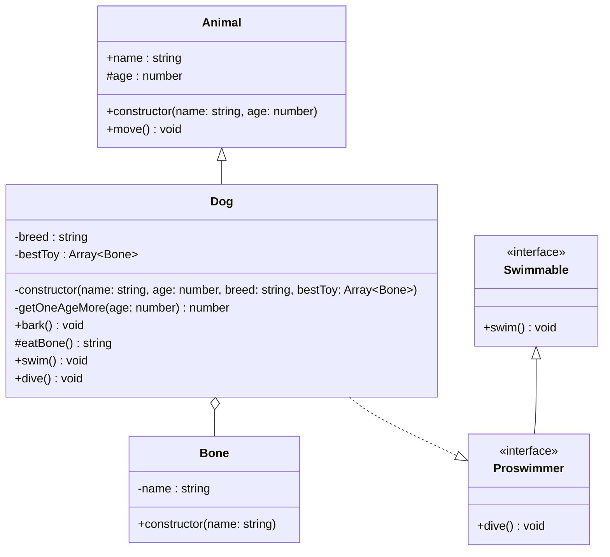

```mermaid
classDiagram
 class Animal {
 +name : string
 #age : number
 +constructor(name: string, age: number) 
 +move() void
 }

 class Dog {
 -breed : string
 -bestToy : Array~Bone~
 -constructor(name: string, age: number, breed: string, bestToy: Array~Bone~) 
 -getOneAgeMore(age: number) number
 +bark() void
 #eatBone() string
 +swim() void
 +dive() void
 }

 class Bone {
 -name : string
 +constructor(name: string) 
 }

 class Swimmable {
 <<interface>>
 +swim() void
 }

 class Proswimmer {
 <<interface>>
 +dive() void
 }

 Animal <|-- Dog
 Dog o-- Bone
 Dog ..|> Proswimmer
 Swimmable <|-- Proswimmer
```
