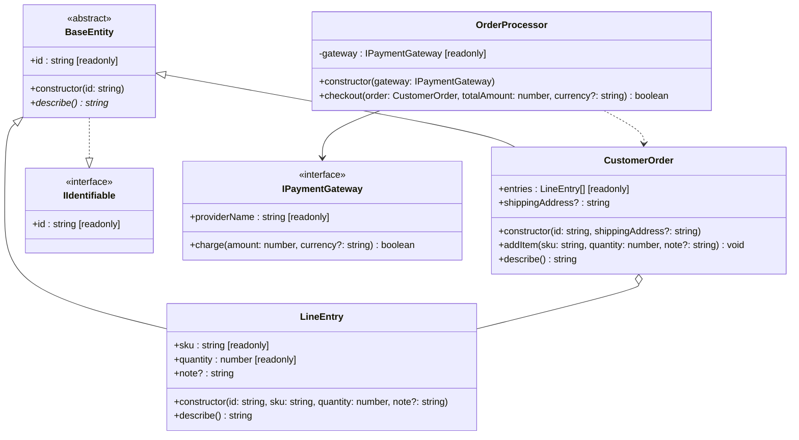

```mermaid
classDiagram
    class BaseEntity {
        <<abstract>>
        +id : string [readonly]
        +constructor(id: string)
        +describe() string*
    }

    class LineEntry {
        +sku : string [readonly]
        +quantity : number [readonly]
        +note? : string
        +constructor(id: string, sku: string, quantity: number, note?: string)
        +describe() string
    }

    class CustomerOrder {
        +entries : LineEntry[] [readonly]
        +shippingAddress? : string
        +constructor(id: string, shippingAddress?: string)
        +addItem(sku: string, quantity: number, note?: string) void
        +describe() string
    }

    class OrderProcessor {
        -gateway : IPaymentGateway [readonly]
        +constructor(gateway: IPaymentGateway)
        +checkout(order: CustomerOrder, totalAmount: number, currency?: string) boolean
    }

    class IIdentifiable {
        <<interface>>
        +id : string [readonly]
    }

    class IPaymentGateway {
        <<interface>>
        +providerName : string [readonly]
        +charge(amount: number, currency?: string) boolean
    }

    BaseEntity ..|> IIdentifiable
    BaseEntity <|-- LineEntry
    BaseEntity <|-- CustomerOrder
    CustomerOrder o-- LineEntry
    OrderProcessor --> IPaymentGateway
    OrderProcessor ..> CustomerOrder
```
