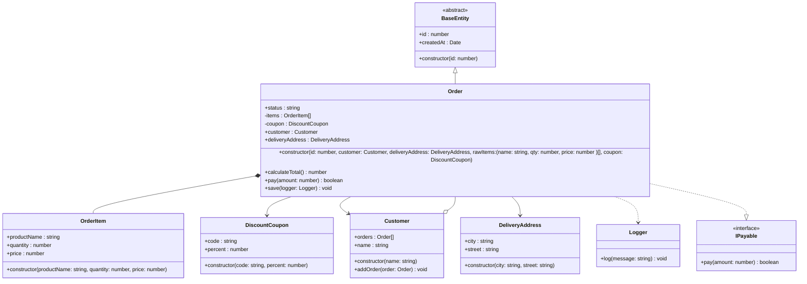

```mermaid
classDiagram
    class BaseEntity {
        <<abstract>>
        +id : number
        +createdAt : Date
        +constructor(id: number)
    }

    class OrderItem {
        +productName : string
        +quantity : number
        +price : number
        +constructor(productName: string, quantity: number, price: number)
    }

    class DiscountCoupon {
        +code : string
        +percent : number
        +constructor(code: string, percent: number)
    }

    class DeliveryAddress {
        +city : string
        +street : string
        +constructor(city: string, street: string)
    }

    class Logger {
        +log(message: string) void
    }

    class Customer {
        +orders : Order[]
        +name : string
        +constructor(name: string)
        +addOrder(order: Order) void
    }

    class Order {
        +status : string
        -items : OrderItem[]
        -coupon : DiscountCoupon
        +customer : Customer
        +deliveryAddress : DeliveryAddress
        +constructor(id: number, customer: Customer, deliveryAddress: DeliveryAddress, rawItems: ( name: string, qty: number, price: number )[], coupon: DiscountCoupon)
        +calculateTotal() number
        +pay(amount: number) boolean
        +save(logger: Logger) void
    }

    class IPayable {
        <<interface>>
        +pay(amount: number) boolean
    }

    Customer o-- Order
    BaseEntity <|-- Order
    Order *-- OrderItem
    Order --> DiscountCoupon
    Order --> Customer
    Order --> DeliveryAddress
    Order ..> Logger
    Order ..|> IPayable
```
