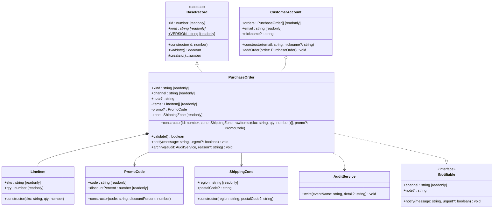

```mermaid
classDiagram
    class AuditService {
        +write(eventName: string, detail?: string) void
    }

    class ShippingZone {
        +region : string [readonly]
        +postalCode? : string
        +constructor(region: string, postalCode?: string)
    }

    class PromoCode {
        +code : string [readonly]
        +discountPercent : number [readonly]
        +constructor(code: string, discountPercent: number)
    }

    class LineItem {
        +sku : string [readonly]
        +qty : number [readonly]
        +constructor(sku: string, qty: number)
    }

    class BaseRecord {
        <<abstract>>
        +id : number [readonly]
        +kind : string [readonly]*
        +VERSION : string [readonly]$
        +constructor(id: number)
        +validate() boolean*
        +createId() number$
    }

    class PurchaseOrder {
        +kind : string [readonly]
        +channel : string [readonly]
        +note? : string
        -items : LineItem[] [readonly]
        -promo? : PromoCode
        -zone : ShippingZone [readonly]
        +constructor(id: number, zone: ShippingZone, rawItems: ( sku: string, qty: number )[], promo?: PromoCode)
        +validate() boolean
        +notify(message: string, urgent?: boolean) void
        +archive(audit: AuditService, reason?: string) void
    }

    class CustomerAccount {
        +orders : PurchaseOrder[] [readonly]
        +email : string [readonly]
        +nickname? : string
        +constructor(email: string, nickname?: string)
        +addOrder(order: PurchaseOrder) void
    }

    class INotifiable {
        <<interface>>
        +channel : string [readonly]
        +note? : string
        +notify(message: string, urgent?: boolean) void
    }

    BaseRecord <|-- PurchaseOrder
    PurchaseOrder *-- LineItem
    PurchaseOrder --> PromoCode
    PurchaseOrder --> ShippingZone
    PurchaseOrder ..> AuditService
    PurchaseOrder ..|> INotifiable
    CustomerAccount o-- PurchaseOrder
```
